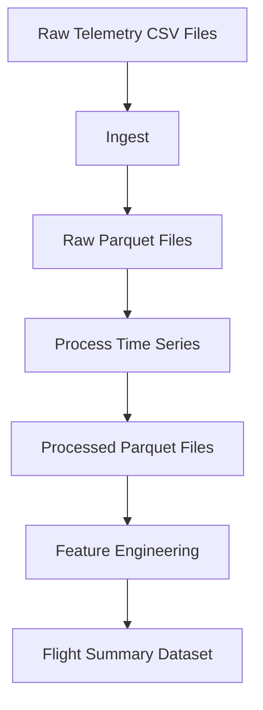

# Flight Telemetry Data Pipeline

## Overview

This project builds an end-to-end data pipeline for processing aviation telemetry data. The goal is to transform raw flight sensor data into a structured, analysis-ready dataset suitable for downstream analytics and modeling.

The pipeline ingests raw telemetry files, standardizes time-series data, and generates flight-level features that capture both overall flight characteristics and dynamic behavior.

---

## Why this project

Telemetry data is inherently complex:

- Sensors operate at different sampling rates
- Data includes both continuous signals, such as altitude and speed, and discrete states
- Missing or noisy data is common
- Raw data is not immediately suitable for analysis

This project focuses on building a structured pipeline that:

- standardizes telemetry data
- preserves signal fidelity
- handles real-world data imperfections
- produces consistent, model-ready outputs

---

## Current Pipeline

The pipeline is currently orchestrated using **Dagster**. Each stage is defined as a Dagster asset, allowing the pipeline to be executed, monitored, and inspected through the Dagster UI.

Current asset flow:

```text
ingest -> process -> features
```

Dagster provides:

- asset-based pipeline modeling
- dependency management
- execution logs
- run metadata
- selective or full pipeline materialization

---

## Pipeline Stages

### Ingest

The ingest stage converts raw telemetry CSV files into Parquet format.

Responsibilities:

- Read raw CSV telemetry files from the raw data directory
- Convert files to Parquet for better storage efficiency and downstream performance
- Skip files that have already been processed
- Track processed, skipped, and failed files

Output:

```text
data/raw/parquet/
```

---

### Process

The process stage prepares raw Parquet telemetry files for analysis.

Responsibilities:

- Normalize column names
- Construct a unified timestamp from date and time components
- Sort each flight chronologically
- Remove invalid or incomplete records
- Write cleaned time-series files to the processed data directory

Output:

```text
data/processed/parquet/
```

---

### Feature Engineering

The feature engineering stage aggregates processed time-series telemetry into one summary row per flight.

Generated features include:

- flight duration
- maximum altitude
- mean altitude
- altitude standard deviation
- altitude range
- true airspeed mean
- true airspeed standard deviation
- true airspeed range
- ground speed mean
- ground speed standard deviation
- dynamic behavior metrics such as climb rate and speed change

Output:

```text
data/features/flight_summary.parquet
```

---

## Running the Pipeline

Start Dagster locally:

```bash
cd orchestration
dagster dev
```

Then open the Dagster UI:

```text
http://localhost:3000
```

From the Dagster UI, you can:

- materialize individual assets
- run the full pipeline
- inspect logs
- review execution metadata
- troubleshoot failed stages

---

## Architecture



---

## Design Principles

- **Modular stages**: Each pipeline phase is separated into a distinct asset.
- **Idempotency**: Stages can be safely re-run without duplicating completed work.
- **Separation of concerns**: Ingest, processing, and feature generation are handled independently.
- **Observability**: Dagster provides visibility into logs, materializations, and run metadata.
- **Extensibility**: The pipeline is designed to support additional processing steps, validation, and storage targets.

---

## Future Work

### Dockerization

Containerize the project to provide a consistent runtime environment across machines.

Planned improvements:

- create a Dockerfile for the Dagster project
- standardize Python runtime and dependencies
- mount local or external data directories into the container
- support repeatable execution outside the local development environment

---

### CI/CD Integration

Add automated validation using GitHub Actions or GitLab CI.

Planned improvements:

- run linting and unit tests on every commit
- validate pipeline logic against a small sample dataset
- confirm required dependencies install successfully
- prevent regressions before changes are merged

---

### PostgreSQL Integration

Persist processed and feature-level outputs into PostgreSQL for query-based analytics.

Planned improvements:

- store flight summary features in relational tables
- support incremental updates
- enable downstream reporting, dashboards, or APIs
- provide a foundation for historical analysis

---

### Data Quality Checks

Add Dagster asset checks to validate data quality across the pipeline.

Planned checks:

- missing timestamps
- empty output datasets
- invalid flight duration
- missing flight identifiers
- out-of-range altitude or speed values
- failed file counts above an acceptable threshold

---

### Partitioning and Scalability

Introduce partitioned assets for more scalable processing.

Planned improvements:

- process one flight or batch of flights per partition
- selectively reprocess failed or changed flights
- improve performance for larger datasets
- support future parallel execution patterns

---

### Advanced Feature Engineering

Expand the feature set to better capture flight behavior.

Potential features:

- climb rate statistics
- descent rate statistics
- acceleration and deceleration patterns
- altitude stability
- speed variability
- anomaly indicators
- phase-of-flight derived metrics

---

## Summary

This project demonstrates a structured, production-oriented approach to processing aviation telemetry data. The current implementation uses Dagster to orchestrate an end-to-end pipeline that ingests raw telemetry, processes time-series data, and generates flight-level features for downstream analysis.

Future work will focus on containerization, CI/CD automation, PostgreSQL persistence, data quality validation, and scalable partitioned execution.
